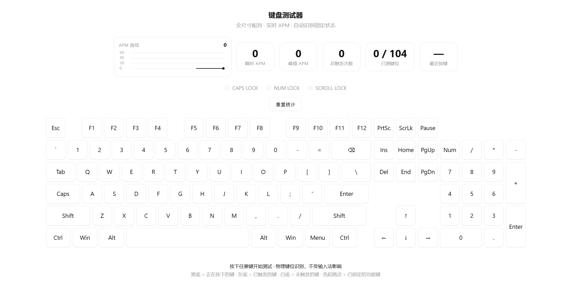

[English](README.md) | [简体中文](README_Simplified_Chinese.md) | [繁体中文（文言）](README_Classical_Chinese.md)

A single HTML file implements a **full-size 108-key keyboard testing tool** that monitors key presses in real time and provides APM (Actions Per Minute) statistics and visualization.

---

## I. Feature Overview

- **Keyboard Layout Rendering**
  Builds a standard full-size keyboard (main cluster, navigation cluster, numpad) with 108 physical keys (including function keys, editing keys, arrow keys, and numpad). Each key is dynamically generated with CSS Grid and Flex layouts, with responsive sizing (`clamp` units).

- **Real-time Key Monitoring**
  Listens to `keydown` / `keyup` events, accurately maps them to the corresponding DOM element based on `event.code` and `event.location`, and synchronizes visual feedback:
  - On press → **black background, white text** (`active` class)
  - After release → **gray background** (`hit` class), indicating the key has been triggered
  - Not triggered → **white background**

- **Statistics**
  The top bar shows five metrics:
  - **Instant APM**: number of key presses within the last 1 second converted to a per-minute rate
  - **Peak APM**: highest instant value recorded
  - **Total Triggers**: cumulative key press count (including repeats)
  - **Keys Tested**: number of distinct keys triggered / total mappable keys
  - **Last Key**: shows the last triggered key name, raw `code`, and `location` value (useful for diagnosis)

- **Lock State Indicators**
  Automatically reads `CapsLock`, `NumLock`, `ScrollLock` states and displays them via LED dots and the small dots at the top-right corner of the corresponding keys.

- **APM Curve**
  Drawn on Canvas, samples the instant APM every 500ms, keeping the most recent 120 points (a 60-second window). The curve scrolls and updates, showing the current instant value.

- **Reset Function**
  One-click clears all statistics, curve data, and key highlight states, restoring the initial state.

---

## II. Technical Implementation

### 1. Page Structure and Layout
- Uses a hybrid Flex and CSS Grid layout. The top `topbar` contains the curve chart and statistic cards; the middle keyboard body is divided into `main` (main key column), `nav` (navigation column), and `numpad-col` (numpad column).
- Key sizes are controlled by the CSS variable `--u` (`clamp(24px, 4.3vw, 50px)`), adapting to different screen sizes.
- Keys spanning rows/columns (e.g., numpad `+`, `Enter`, `0`) are implemented via `grid-row: span 2` or `grid-column: span 2`.

### 2. Data-Driven Generation
- All keys are defined in a JavaScript array. Each key object contains `label` (display text), `code` (corresponding `event.code`), `w` (width multiplier, supporting 1.25, 1.5, 2.25, etc.), and `cls` (extra class, such as `tall` / `wide`).
- The navigation area includes `spacer` placeholder elements to keep rows and columns aligned.
- During rendering, the data is traversed to generate the DOM, and a mapping table from `code` to DOM element (`codeMap`) is built for fast lookup in event callbacks.

### 3. Event Handling and Key Identification
- **Modifier Key Left/Right Distinction**
  For `Shift`, `Control`, `Alt`, `Meta`, `event.location` (`LEFT=1` / `RIGHT=2`) is used first to determine left/right, avoiding reliance solely on `event.code` (some systems or IMEs may misreport). When `location` is `0` (cannot be determined) and `code` is empty, it is judged as an abnormal injected event (e.g., right Shift hijacked), and handled as the right key.
- **Prevent Default Behavior**
  Calls `preventDefault()` for Space, arrow keys, Tab, Backspace, function keys, etc., to prevent page scrolling or focus switching, ensuring the test is not disturbed.
- **Blur Handling**
  When the page loses focus (e.g., pressing the Win key pops up a menu), clears all keys' `active` state to avoid a "stuck key" illusion.

### 4. APM Calculation and Drawing
- **Instant APM**: maintains a timestamp array `hits` recording the `performance.now()` timestamp of each key press. When calculating, take the count within the last 1 second and multiply by 60 to convert to a per-minute rate.
- **Peak APM**: compares the instant value after each update and keeps the maximum.
- **Curve Chart**:
  - Samples the instant APM every 500ms, stored in the ring buffer `apmBuf` (max 120 points).
  - When drawing, the Y-axis uses integer multiples of 60 as the tick upper limit (dynamically rounded), and the X-axis scrolls from right to left (newest point fixed at the far right).
  - Includes grid lines, fill area, and polyline, highlighting the current value.

### 5. Lock State Synchronization
- In `keydown` and `keyup`, calls `e.getModifierState()` to get the three lock key states and update the LED indicators and small dots on the keys.

---

## III. Interaction Logic Details

| Action | Visual Feedback | Statistics Update |
|--------|-----------------|-------------------|
| Press any key | The corresponding key turns black background, white text (`active`), and is immediately marked as "triggered" (add `hit` class, gray background retained after release) | Record timestamp, total count +1, update instant APM, peak, last key, keys tested |
| Release key | Black background removed, gray background retained | No new statistics (but lock state may change) |
| Toggle lock key | LED and key dots sync on/off | None |
| Page loses focus | All black backgrounds cleared | None |
| Reset button | All keys cleared of black and gray backgrounds | Clear all statistics, curve cache, APM reset to zero |

**Key Design**:
- Adding the `hit` class in `keydown` ensures the "triggered" mark is retained even if the `keyup` event is lost (e.g., Win key pops up the Start menu).
- The last key display includes `code` and `location` for debugging key mapping correctness.

---

## IV. Design Highlights and Thoughtful Touches

1. **Accuracy and Compatibility**
   - Compatible with key differences across operating systems and browsers (e.g., Mac's Meta key).
   - Double-checks modifier key left/right position (location + code) to adapt to IME hijacking scenarios.

2. **Intuitive Visual Feedback**
   - Three-state colors (white/black/gray) clearly distinguish "not triggered / pressed / triggered".
   - Lock key dots sync with system state with no delay.

3. **Performance Optimization**
   - Uses `performance.now()` instead of `Date.now()` for higher precision.
   - Timer intervals (250ms for stats update, 500ms for curve sampling) balance smoothness and performance.

4. **Responsive Design**
   - Key sizes change with the viewport, displaying well on phones, tablets, and desktops.
   - Canvas adjusts resolution based on devicePixelRatio to ensure clarity on high-DPI screens.

5. **User Guidance**
   - Bottom hint explains the color meanings and functions, lowering the usage threshold.

---

---

## License

[MIT](LICENSE)
